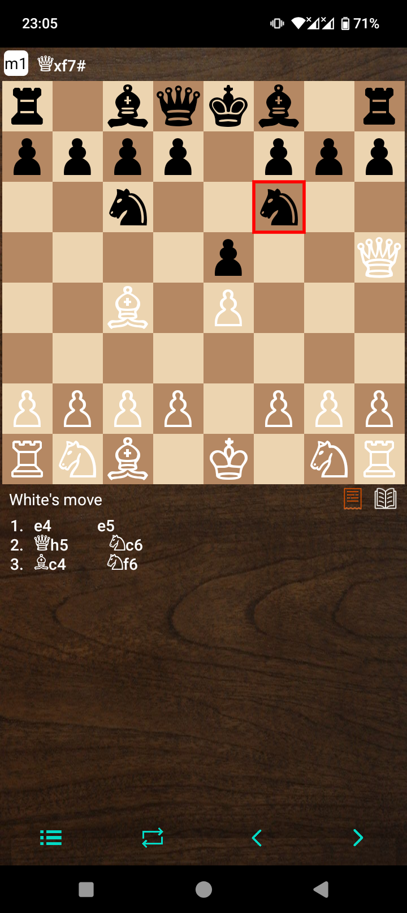
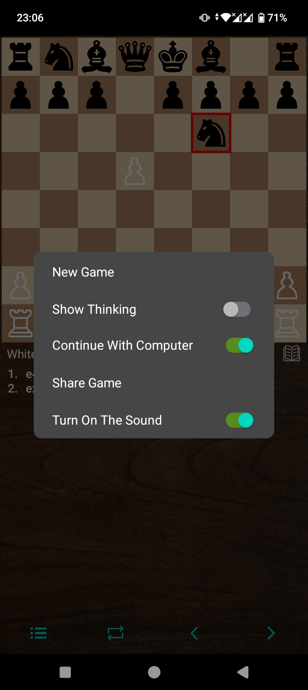
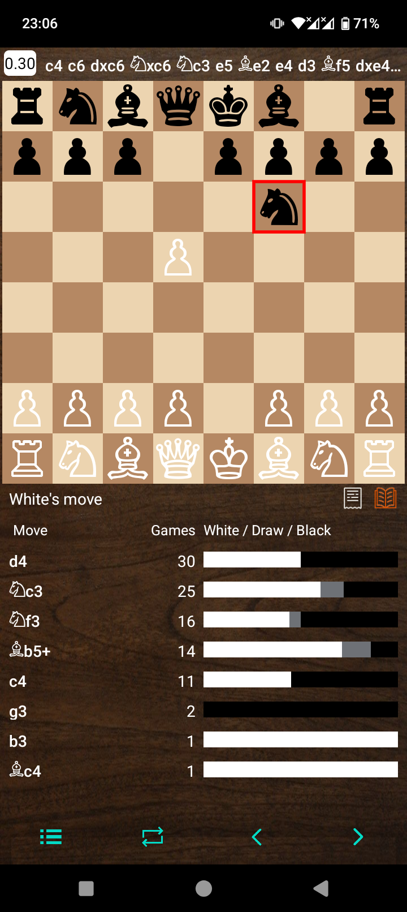

# HorsyAnalysis 🐴♟️

HorsyAnalysis is an Android chess application developed in Java, designed to help chess enthusiasts analyze games, explore move databases, and improve their skills. Powered by the CuckooChessEngine

## Features

* **Interactive Chessboard:** Play and analyze chess games.
* **CuckooChessEngine Integration:** Get real-time analysis with a powerful chess engine.
* **Move Database:** Explore chess moves and openings.

## Screenshots

Here's a glimpse of HorsyAnalysis in action:

|              Chess Game & Analysis               |           App Menu           |               Moves Database                |
|:------------------------------------------------:|:----------------------------:|:-------------------------------------------:|
|  |  |  |

## Warning

HorsyAnalysis does use **Firebase Analytics** and **Firebase Crashlytics** so in case you want to build it without any tracking you can checkout  or build it with you firebase project values into [google-services.json](app/google-services.json.example)
